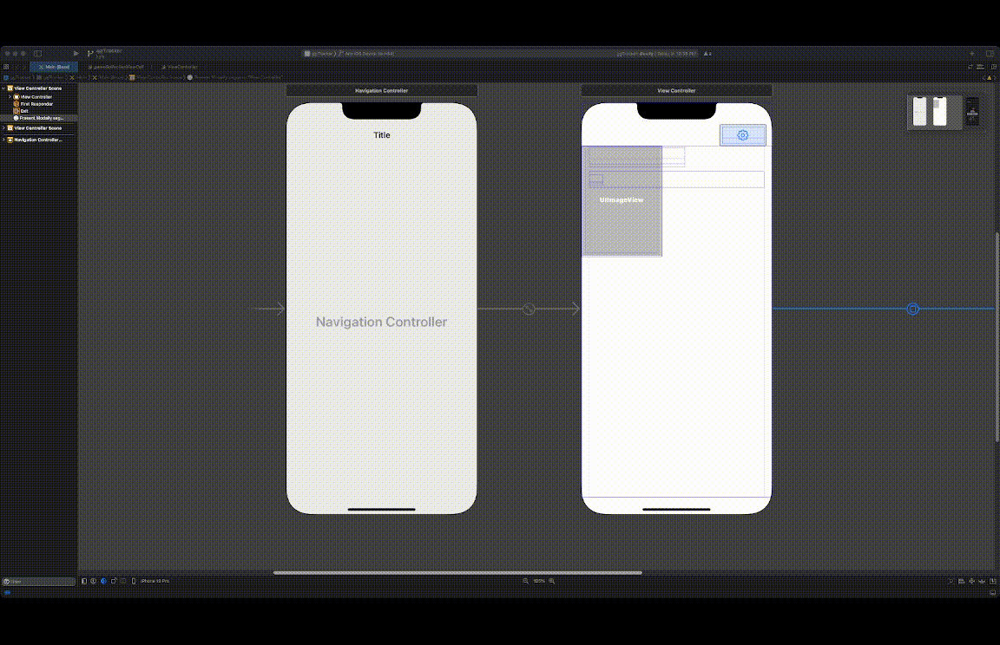

Original App Design Project - Group 2
===

# ggTracker
An iOS app to track your gaming habits.

## Table of Contents
1. [Overview](#Overview)
2. [Product Spec](#Product-Spec)
3. [Wireframes](#Wireframes)
4. [Schema](#Schema)
5. [Sprint 1](#Sprint-1)
6. [Sprint 2](#Sprint-2)
7. [Sprint 3](#Sprint-3)
8. [Sprint 4](#Sprint-4)

## Overview
### Description
Our application, GGTracker, allows users to track their video game catalog as well as track their progress through completing different video games. Users will be able to give the game a rating based on their experience through a playthrough through the game. 

### App Evaluation

- **Category:** Video Games / Social Networking
- **Mobile:** Our application would be primarily designed for mobile use, specifically iOS. We would try to abstract the functionality to keep the code relatively the same if a different type of application for ggTracker was to be created in the future.
- **Story:** ggTracker allows users to track the video games that they have played or are currently playing in a simplistic, easy way.
- **Market:** Our application would target users that enjoy and play video games. We aim to have our app be an app that users come back to frequently as they continue to play through new trending games. 
- **Habit:** The application would encourage users to maintain their video game list, but it would be up to the user to keep their list maintained.
- **Scope:** The app would be be applicable to individual users so that they could manage their played games. This could then evolve into a larger social network where users can find like minded individuals. Our app could eventually be used by TwitchTV or other game publishers to promote a product.

## Product Spec

### 1. User Stories (Required and Optional)
*Each user story is broken up into subcomponents, which will be checked off after each sprint.*

**Required Must-have Stories**

---
* **User sees an app icon on the home screen and a styled launch screen.**
    * [x] User can see the ggTracker app icon.
    * [x] User can see the ggTracker launch screen.
* **User can login.**
    * [x] User can access the login screen. 
    * [x] User can see a sign in button. 
    * [x] User can see a sign up botton. 
* **User can view and scroll through a list of top games on the discover page.**
    * [x] User can see a CollectionView where games will be.
    * [x] User can tap on a game poster on the CollectionView to view the details for the game on the details screen. 
    * [x] On the details screen, user can see an ImageView for the game poster.
    * [x] On the details screen, user has a button to add the game to user's wish list.
    * [x] On the details screen, user has a button to add the game to the user's home screen.
    * [x] On the details screen, user can see an area for the game description.
    * [x] On the details screen, user can go back to the discover screen.
* **User can add a game to their home page.**
    * [x] User should be able to see a TableView with rows for their games.
    * [x] Users must be able to see the area with the status for their games.
    * [x] Users must be able to see the area with the hours played for their games.
    * [x] Users must be able to see the area with their rating for their games.
    * [x] Users must be able to see and click on an edit button that brings them to a screen that allows them to edit their game information. 
    * [x] Users must be able to see a settings button in the nav bar.
* **User can edit their hours, rating, and status for games added to their home page.**
    * [x] User can access the edit screen.
    * [ ] User can view the game in the edit screen.
    * [ ] User can edit the status for their games in the edit screen.
    * [ ] User can edit their hours played for their games in the edit screen.
    * [ ] User can edit the status for their games in the edit screen.
* **User can view the creators of the app.**
    * [x] User can see the Team Penguinos icon.
    * [x] User can view team members' names.

**Optional Nice-to-have Stories**

---
* **User stays logged in across restarts.**
* **User can search for games on the discover page using a search bar.**
* **User can view the details for a particular game on the discover page.**
* **User can wishlist a game.**
* **User can view all of their wishlisted games.** 
* **User can change default settings in a settings area.**
* **User can leave a note on games from their home page.** 
* **User can login with Google, Twitter, and/or Facebook.** 

**Other App Requirements**

---
* **IGDB Game Database API**
    * [x] Secret key must be generated. 
    * [x] Get the game details for a list of top games. 
    * [x] Get the game names for a list of top games.
    * [x] Get the game poster for the list of top games.
* **Parse**
    * [x] Parse must be set up.

### 2. Screen Archetypes

* **Login/Register Screen**
   * Users are able to sign up or log into their account.
   * When opening the application for the first time, the user is prompted to log in to their profile in order view the list of available games.

* **Discover Screen**
    * Users are able to view the available list of games that are available to add to their collection. 
    * Shows the cover art for each game. 
    * Users are able to add the game to their home screen or wishlist.

* **Home Screen**
    * Contains the list of the games that the user has added to their list of played games. 
    * Displays the game activity, amount of logged hours, and the user's rating for the game. 

* **Game Details (Optional Screen) Screen**
    * Shows a particular game's cover art and synopsis to the user if they click that game on the discover page. 
    * Allows the user to add the game to their home screen (or wishlist, if that optional story is implemented).

* **Edit Game Screen**
    * Allows the user to edit their hours, rating, and status for a given game listed on their home page.

* **Wishlist (Optional Screen) Screen**
    * Shows the list of the games that the user would like to play at some point in the future. 
    * Displays the cover art for the game displayed.

* **About Screen**
    * Shows the user information about the team that has developed the application. 

### 3. Navigation

**Tab Navigation** (Tab to Screen)

* Discover
* Home
* Wishlist

**Flow Navigation** (Screen to Screen)

* Login/Register Screen -> Home Screen (if the user is successfully logged into their account or has registered a new account)
* Discover Tab -> Games Details Screen
* Wishlist -> Games Details Screen
* Discover Tab/Wishlist/Home Screen -> About Screen
* Home Screen -> Edit Game Details Fields

## Wireframes
* Hand-Sketched Wireframe


### [BONUS] Digital Wireframes & Mockups
* Digital Wireframe

To see all of the individual frames of the digital wireframe more clearly, please navigate to the "ggTracker Digital Wireframe Individual Frames Compressed File.pdf" file.


## Schema 
### Models

   
#### Users
*This is for the users of the system.*
   | Property      | Type     | Description |
   | ------------- | -------- | ------------|
   | Username      | String   | User's username|
   | Password      | String   | User's password |
   
   
#### Favorites
*This is for the games listed on a user's home page.*
 
   | Property      | Type     | Description |
   | ------------- | -------- | ------------|
   | UserID      | ID   | Reference to the Users table|
   | GameID        | ID   | Used to get the games information from the API call|
   | Status     | Integer   | Distinguish between the games different states  |
   | UserRating     | Integer   | User's rating for the game |
   | UserHours      | Integer   | User's hours for the game |
   
   
#### Wishlist (Optional)
*This is for the games listed on a user's wishlist.*
 
   | Property      | Type     | Description |
   | ------------- | -------- | ------------|
   | UserID        | ID       | Reference to the Users table|
   | GameID        | ID       | Used to get the games information from the API call|


### Networking
#### List of network requests by screen
   - **Home Screen**
      - (Read/GET) Query all games in the userHomeList
      - (Delete) Delete a game from the userHomeList
   - **Edit Screen**
      - (Update/POST) Update status of the game
      - (Update/POST) Update user rating of the game
      - (Update/POST) Update hours played of game
   - **Discover Screen**
      - (Read/GET) Get list of top games from IGDB database
        ```swift
        func getTopGames()  {
        requestAccessToken { accessToken in
            let wrapper: IGDBWrapper = IGDBWrapper(clientID: self.clientID, accessToken: accessToken)
            
            let apicalypse = APICalypse()
                .fields(fields: "name, rating, summary, release_dates, cover")
                .limit(value: 100)
                .sort(field: "rating", order: .DESCENDING)
                .where(query: "rating > 95")
            
            wrapper.jsonGames(apiCalypse: apicalypse) { games in
                print("\(games)")
            } errorResponse: { error in
                print("\(error)")
            }
        }
         ```
   - **Details Screen**
      - (Read/GET) Query IGDB database for game details
      - (Create/POST) Add a game to userHomeList
      - (Create/POST) Add a game to userWishlist (optional)
   - **Wishlist Screen** (Optional Screen)
      - (Read/GET) Query all games in the userWishlist (optional)
      - (Delete) Delete a game from the userWishlist (optional)


### ENDPOINTS

   | Property      | Type     | Description |
   | ------------- | -------- | ------------|
   | name          | String   | Name of the game|
   | rating        | Double   | Rating of the game |
   | status        | String   | Status of the game |
   | cover         | String   | URL to poster image |
   | summary       | String   | Description of the game |
   | release date  | ID       | ID referring to release date |


##### IGDB Game Database API
- Base URL - [https://api-docs.igdb.com/v4/games](https://api-docs.igdb.com/v4/games)

   HTTP Verb | Endpoint | Description
   ----------|----------|------------
    `GET`    | /name | Name of game
    `GET`    | /rating| Average IGDB user rating
    `GET`    | /summary   | A description of the game
    `GET`    | /release_dates | Release dates of this game
    `GET`    | /cover | Reference ID for cover

## Sprint 1
### Progress Descriptions & GIFs
*For this sprint, the team worked on setting ourselves up for success early on. The group worked on getting data from the IGDB game database API, setting up the Parse server, and getting the UI, outlets, and associated files created/completed for the screens.*

---

#### Paulina DeVito
* I worked on creating the UI home screen, where users will see their personal list of games.
    * List of things I accomplished:
        * Created the table view, which has a cell for each game that a user has added to their home screen
        * Made each table view cell have rounded edges and margins for padding
        * Customized background and table cell colors 
        * Added an image view to the prototype cell for the game poster, which I will be fetching from Parse in the upcoming sprint
        * Added labels to the prototype cell to show a particular game's status, hours played, and user rating
        * Created a settings icon at the top of the view, which will be used to navigate to the settings page
* I also created the edit screen. I will be continuing the edit screen in the upcoming sprint. 
* Lastly, I have been helping manage the GitHub Project Board, especially the issues.


---

#### Siobahn Devlin
* I worked primarily on getting the backend set up to talk to the IGDB API. I also set up the GitHub Project Board and manage the builds and branches. 
    * List of things I accomplished:
        * Set up initial main branch and sub branches
        * Set up the IGDB API and dependencies for the project
        * Set up the GitHub Project Board (Paulina helped majorly with this)
        * Wrote function to get the access token for each request
        * Wrote function to get the list of top ten games based off of rating
        * Wrote function to convert JSON data into a Swift object called Game
        * Wrote the data model for a game
        * Helped deal with environment and build issues for team members getting set up with the project


---

#### Kirk Shields
* I worked on creating the database for Parse and began to create the view that would be shown to the user for adding a game to either their home screen or favorites.
    * List of things I accomplished:
        * Set up the database and Parse tables for the game information
        * Created the game details view, which shows the information about the game to the user
        * Created the controls that will add a game to the user's home screen or favorites
        * Created the image view for the game's cover art
        * Created a function that will give me specific game details from the API


---

#### Kyle Deveaux
* During this sprint, I worked on creating the about page. The page includes everyone who worked on the Team Penguinos project and features a static image of our mascot. I also started to work ahead on the collection view for the discover screen.
    * List of things I accomplished:
        * Set up the about page
        * Listed the team names
        * Included static image and styling to the about page
        * Prepared for upcoming sprint by starting the CollectionView
            * Set up the view controller for the discover screen in the main storyboard
            * Coded view controller
            * Waiting on API to start the implementation into current code



## Sprint 2
### Progress Descriptions & GIFs
*For this sprint, the team extended their progress from Sprint 1 and coded more. However, the team ran into some errors, mostly with the API. The group has decided that they will be holding extra meetings for Sprint 3 to get everything they couldn't solve this week solved. In these additional meetings, the group plans to combine all of the work we have been doing on our individual GitHub branches, solve the API problem we are having (getting the game poster URL, specifically), testing Paulina's code from this week by adding data to Parse, and debugging any issues. The group aims to get all of the required functionality completed by next week, as intended.*

---

#### Paulina DeVito
* I worked on creating the UI for the edit screen, where users be able to edit the status, hours, and rating for their personal list of games. I also wrote the code that accesses data from Parse for the home screen. I will have to test this code next sprint (Sprint 3) because I am waiting on my other teammates to get their screens completed so that test data can be pushed to Parse. Lastly, I helped compile everyone's submissions for this sprint as well as managed the Project Board. 
    * List of things I accomplished: 
        * Made the edit screen appear when the row is clicked versus making it appear when you click on an icon--the group agreed that this was a better, cleaner design choice
        * Added a logout button to the home screen and coded the logic for it (testing the logic will be during Sprint 3)
        * Coded the logic for the settings button (testing the logic will be during Sprint 3)
        * Created the text fields to input data to update the existing data in Parse for a particular game
        * Created the image view for the game's cover art on the edit screen
        * Coded logic for the homescreen (testing the logic will be during Sprint 3)


---

#### Siobahn Devlin
* I worked on creating the login screen where users can create an account and log in with their account. 
    * List of things I accomplished:
        * Added Parse and AlamoFireImage as dependencies to the project
        * Added the initial login view in the storyboard
        * Hooked up logic for creating and logging in with account
    * Things that did not get done:
        * Was unable to implement login persistance at this point
        * Generating the URL links for the cover art for the games is still proving to be a challenge
            * Will be focusing on this issue in Sprint 3 and might be contacting our professor if necessary for help with this so that I can figure out a working solution in Sprint 3


---

#### Kirk Shields 
* I worked on getting the game title and the game description to load from the API to the requried fields on the view controller.
    * List of things I accomplished:
        * Got the game title to load from the API
        * Got the game description to load from the API
        * Implemented the function for the favorite game button to work and change the icon to red
        * Implemented the function for the add game to home button to work and change the icon to green


---

#### Kyle Deveaux
* I continued to work on the collection view code. However, I am waiting on and communicating with Siobahn to get the API issue resolved because I cannot fetch the game poster URLs and display them using AlamoFireImage at the current moment. 
* In the upcoming sprint, I will make the CollectionView work as intended.


## Sprint 3
### Progress Descriptions & GIFs
*This sprint's main goal was completing all of the required functionality for the system. **Please note that the gifs for this week are combined from all of the teammates' work and are at the bottom of this section.***


#### Paulina DeVito
* I worked on making the app icon and logo, debugging the other's code with them, and working on my own code.
    * List of things I accomplished: 
        * Created the app icon
        * Created the app logo
        * Worked on fixing the home screen code with the help of Siobahn
        * Worked on formatting and fixing [where needed] Kyle's code for the discover screen
        * Worked with Kirk to get the discover screen loading images and sending data to the 
        * Make the keyboard responsive on the login screen so that it will drop down when the user wants to reach the sign in and sign up buttons on the screen that are typically hidden by the keyboard
        * Worked on a bug on the home screen that would not let you go to the edit screen if you clicked on a TableView cell
        * Co-authored the code for the edit screen (worked with Kirk)


---

#### Siobahn Devlin
* I worked on managing the git branches and getting everything smoothly merged into the main branch. This proved to be quite challenging with the storyboards and we ended up having to separate each group member's "piece" into its own storyboard on their branch, then push their code up to their respective remote branch. I then downloaded all of their branches onto my machine, merged the code onto my local copy of main while dealing with any merge conflicts (there were so many merge conflicts) and then reassembled all the individual storyboards on the main storyboard file. My new, reassembled main branch was pushed to remote so now all members have a "put together" copy of the project.
    * List of things I accomplished: 
        * Helped implement parse functionality for the Home Screen
        * Merged all team member's individual branches onto the main branch
        * Fixed all merge conflicts for the above bullet point
        * Recombined all storyboards back into the main storyboard


---

#### Kirk Shields 
* I worked on creating the function for the API request that would allow me to generate the cover art for the game Detail screen. I was able to set the game cover art on the ViewController. I also integrated the screen with the Discover screen so that the clicked on game would have its details shown. I also allowed users to save their favorite games to the database so that they would be displayed on the Home Screen.
    * List of things I accomplished: 
        * Created the function to get the cover art from the API endpoint
        * Generated the cover art on the Details screen
        * Allowed users to add games to their favorites or their home screen
        * Return users from the Details screen back to the Discover screen
        * Helped Paulina with a bug on the home screen that would not let you go to the edit screen if you clicked on a TableView cell
        * Co-authored the code for the edit screen (worked with Paulina)

---

#### Kyle Deveaux
* I worked on integrating the default gg tracker image to the  discover screen. In doing this the gg tracker app has a foundation where the game covers will be displayed. I also worked with paulina to refactor the code to get the discover viewcontroller push to main. Work with kirk to get the discover screen posters in place of the default ggTracker image. 
    * List of things I accomplished: 
        * Was able to create dulplicate copys of the viewcontroller
        * Able to get the poster images on the Discover screen through kirks code
        * Built a template foundation for the ad video for demo day


